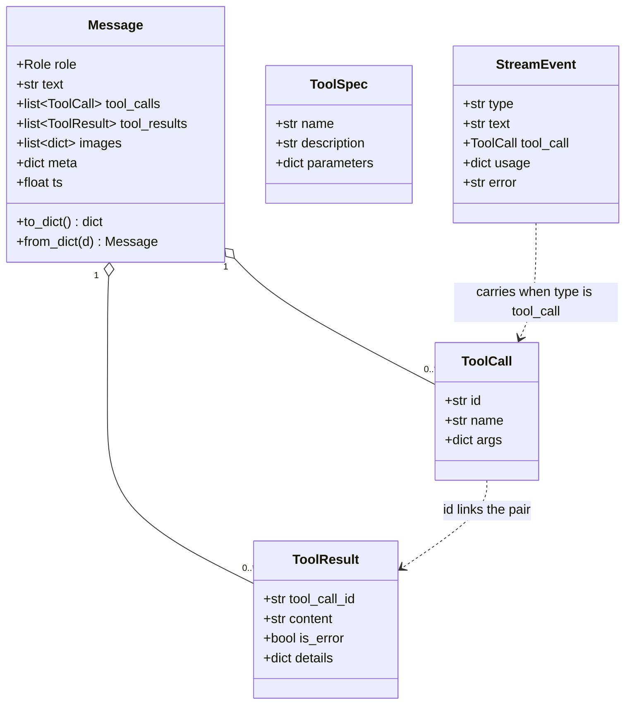
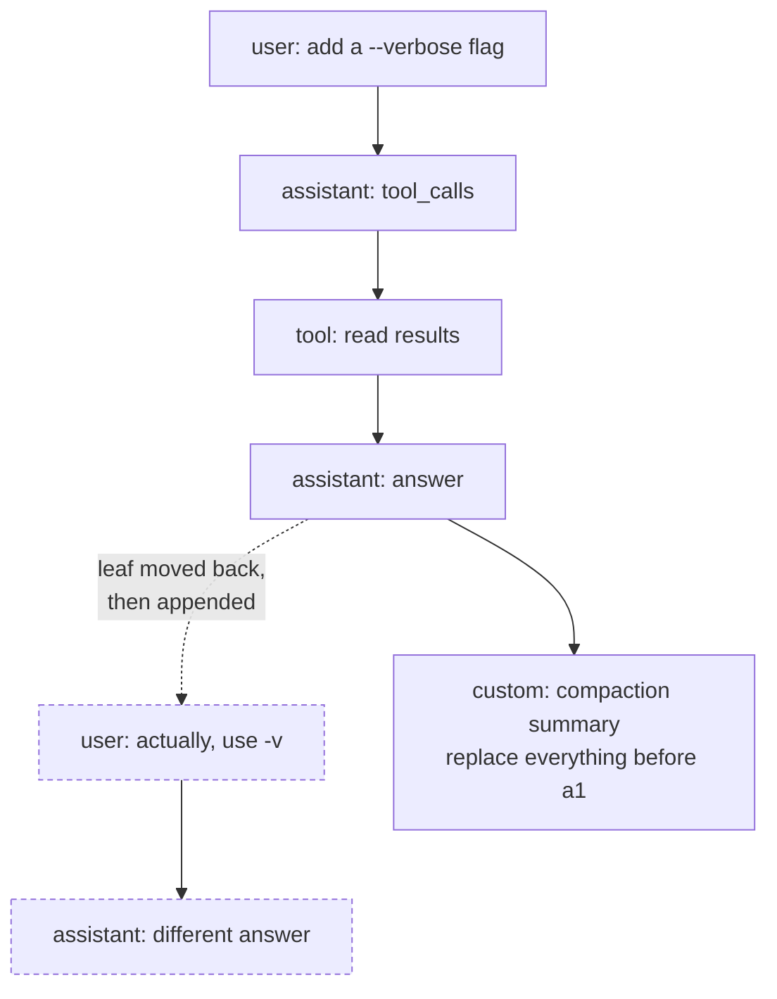

# Data model

## Core types

Everything shared lives in `core/types.py` as plain dataclasses. Providers map these to their
own wire format; nothing else in the codebase defines a message shape.

Two conventions that the shapes encode:

`ToolResult.content` goes to the model; `details` does not. A tool that wants to tell a UI
something without spending context puts it in `details`.

An expected failure is a value, not an exception. A missing file or a non-zero exit returns
`ToolResult(is_error=True)` so the model can read it and recover. Only genuine bugs raise, and
the loop catches those and turns them into the same shape.

## Sessions are a tree, not a list

Each JSONL entry carries an `id` and a `parent`. `leaf` points at the newest entry, and
`branch()` walks parents back to the root to build the model's context. Nothing is ever
deleted or edited in place.

That shape buys three things a flat log cannot:

**Rewind and branch.** Move `leaf` to an older entry and append; the old path still exists and
is still reachable. Undo, alternate takes, and tree UIs are plugin work on top of this file
rather than core features.

**Compaction without loss.** A summary is just another entry saying "when building context,
replace everything before entry X with this". The original messages stay on disk, so the
compaction is auditable and reversible.

**Plugin state that survives restarts.** `api.append_entry(type, data)` writes a custom entry
that is persisted and replayed to the plugin, but never sent to the model.
