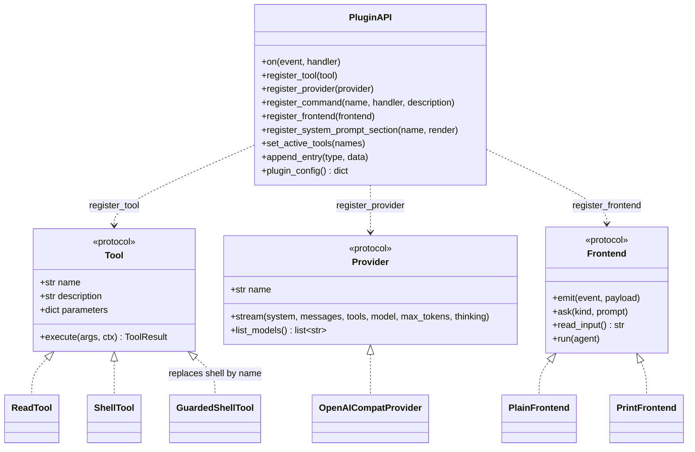
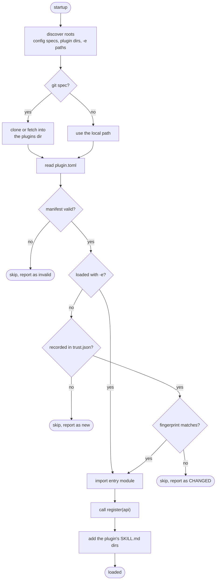
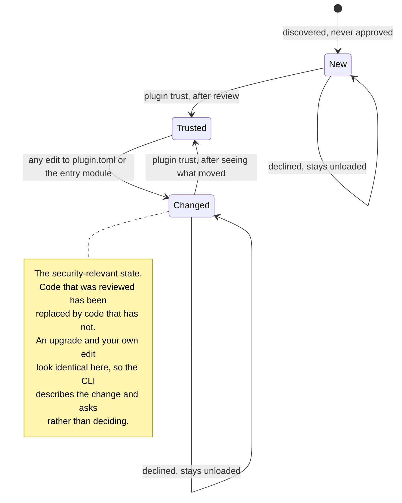

# Plugin lifecycle

## The extension surface

Plugins are structural, not inherited. A tool is any object with the right attributes and an
`execute` coroutine - there is no base class to subclass and no registration decorator. That is
what lets a plugin replace a built-in without importing it.

`list_models` is deliberately optional on `Provider`: not every backend has an equivalent of
`GET /models`, and callers check with `hasattr` rather than forcing a provider to fake one.

## Discovery, trust, load

Plugin code runs with your privileges, so the trust check sits between discovery and import -
nothing is imported before it passes.

`-e` bypasses the trust check for that run only. It exists so an edit-run loop while developing
a plugin doesn't demand re-approval on every save.

## Trust states

The fingerprint is a hash of `plugin.toml` plus the entry module. Any edit invalidates it -
including your own.

`Changed` is why the trust record stores more than a bare hash: per-file hashes name the file
that moved, and the recorded commit turns an upgrade into a reviewable range. A hash alone can
only report *that* something changed, which leaves one blunt response - re-approve and hope.
