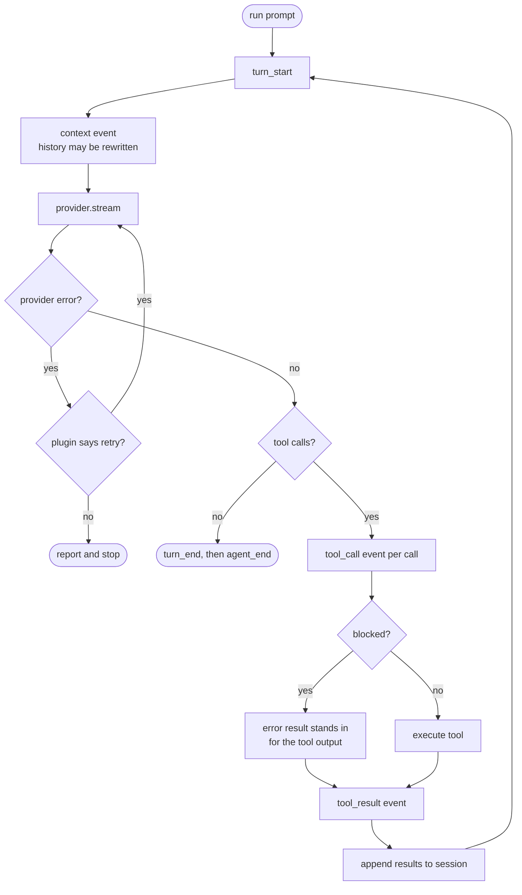

# Request lifecycle

## From keystroke to answer

Every `Bus` arrow below is a point where a plugin can rewrite, patch, or refuse what happens
next. That is the whole extension mechanism: there are no other hooks.

```mermaid
sequenceDiagram
    actor User
    participant FE as Frontend
    participant Loop as AgentLoop
    participant Bus as EventBus
    participant Prov as Provider
    participant Tools as ToolRegistry
    participant Sess as Session

    User->>Loop: handle_input(text)

    alt text is a slash command
        Loop->>Loop: commands.parse()
        Loop-->>FE: notice(result)
        Note over Loop,Sess: no model call, and nothing<br/>is written to the session
    else ordinary prompt
        Loop->>Bus: input
        Bus-->>Loop: text, or "handled" to stop here
        Loop->>Loop: skills.expand()
        Loop->>Loop: prompt.build() + skills.prompt_section()
        Loop->>Bus: before_agent_start
        Bus-->>Loop: system prompt, optional injected message
        Loop->>Sess: append user message

        loop until the model stops calling tools
            Loop->>Bus: turn_start
            Loop->>Bus: context
            Bus-->>Loop: history (compaction rewrites it here)
            Loop->>Prov: stream(system, messages, tools)
            Prov-->>FE: text and thinking deltas
            Prov-->>Loop: assembled tool calls

            opt the model asked for tools
                Loop->>Bus: tool_call, once per call in order
                Bus-->>Loop: allow, rewrite args, or block
                Loop->>Tools: execute (parallel; file edits serialise)
                Tools-->>Loop: ToolResult per call
                Loop->>Bus: tool_result
                Bus-->>Loop: patched content
                Loop-->>FE: tool_result
                Loop->>Sess: append tool results
            end

            Loop->>Bus: turn_end
        end

        Loop->>Bus: agent_end
        Loop-->>Loop: queued follow-ups? run again
        Loop->>Bus: agent_settled
    end
```

Two details worth pulling out, because they are easy to get wrong when writing a plugin:

**Slash commands never reach the session.** `handle_input` matches a command and returns before
any `append_message`, so `/secrets set openai` cannot end up in the transcript or in a later
prompt. That is what makes it safe to type a credential into one.

**A tool result becomes prompt context.** Results are appended to the session and replayed to
the model on the next turn. Anything a tool prints - a command's stdout, a file's contents - is
in the conversation from then on. That is the mechanism behind the credential-guard plugin.

## The turn loop

The loop terminates on one condition only: an assistant message with no tool calls.



The retry branch is how compaction recovers from a context-length error: the plugin catches
`provider_error`, rewrites the history, and asks for the same turn again.
