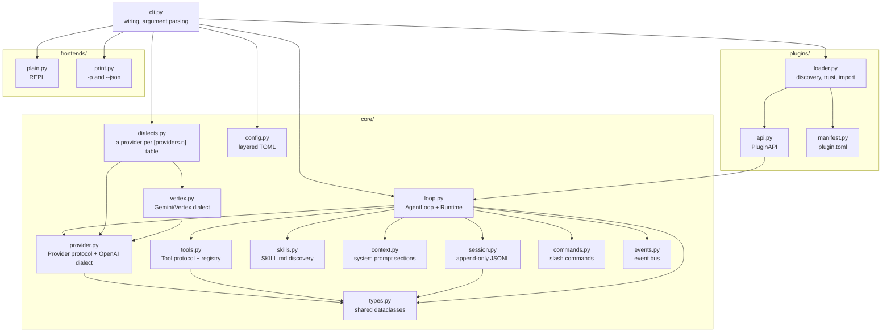
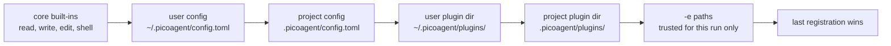

# System overview

## Module dependencies

Dependencies point one way: down. Nothing in `core/` imports from `plugins/` or `frontends/`.
Plugins reach into core through `PluginAPI` and never the reverse, which is what stops a
plugin from being able to break the loop merely by existing - the loop has no knowledge that
any particular plugin is there.

`loop.py` is the only module that knows about every registry. Everything else knows about
`types.py` and whatever sits below it.

## How an override wins

Every registry replaces on name. Registering a tool called `shell` *is* the shell tool from
then on - there is no priority field, no merge, no plugin ordering API. The only thing that
decides a winner is who registers last, and load order decides that:

So a project can override what a user installed, and a one-off `-e` beats both. The same rule
covers providers, commands (`help`), system-prompt sections (`base`), and the frontend - one
mechanism instead of five. Providers reach that ladder one rung earlier than the others: the
user's config registers one per `[providers.<name>]` table before any plugin loads, so a plugin
registering the same name still wins, and a table naming a dialect core does not have registers
nothing at all rather than something that speaks the wrong format.

The cost of that simplicity is worth naming: two plugins that both register `shell` do not
conflict loudly, the later one just wins. `picoagent plugin list` and `/tools` are how you see
what actually ended up registered.
