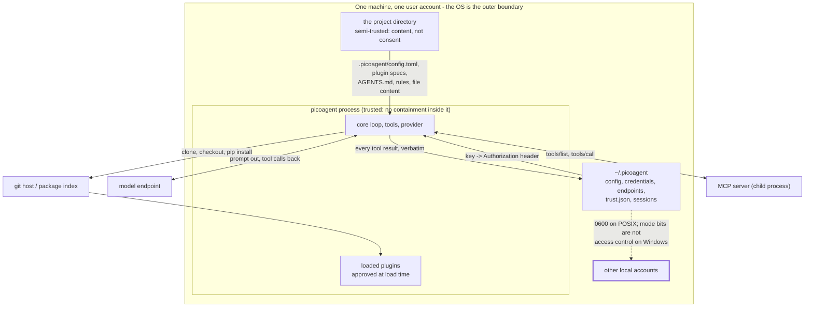

# Threat model

What an adversary would try against picoagent, what stands in the way, and what does not.

[trust-boundaries.md](trust-boundaries.md) says where the lines are and describes shipped
behaviour. This document is the other half: it names the assets worth taking, the adversaries
who would take them, ranks what they would try, and records for each threat what is
implemented, what else was available, and which mitigation was chosen and why. Where a threat
is not mitigated it says so and says what the residual risk is. A threat model that only lists
wins is a marketing document.

Nothing here is aspirational. Every countermeasure named is code in this repository with a test
behind it, and every gap named is a gap today.

## Scope, and how this document is kept honest

**In scope:** the picoagent package (`picoagent/`), the plugins this repository ships as
examples (`examples/plugins/`), and the files picoagent creates and reads under the user's home
directory and inside a project. All of it runs as one local process, as the invoking user.

**Reviewed:** at each release, and whenever a new threat is found rather than only on a
calendar. The trigger for an out-of-cycle review is any of: a new entry point (a new tool, a new
event, a new file picoagent reads that something else can write), a change to who may decide
something (the `USER_ONLY` list, the plugin config layering, the trust store), or a finding from
an adversarial review. The register below is the thing that gets edited; the review record says
what changed.

**Approval.** This repository is developed in the open and is not operated by any one
organization, so nothing here can carry an ISSO or ISSM signature on its own. For a deployment
that requires one, this document is the input to that review: the ISSO and ISSM assess it
against the deployment's own environment (who else has accounts on the host, what egress is
permitted, which plugins are approved) and sign it as part of the deployment package. The
residual risks in section 7 are the paragraphs that review has to accept or compensate for, and
the deployment guidance a site needs to compensate for them is listed there per risk.

### Review record

| Version | Date | Reviewed | Changes |
|---|---|---|---|
| 0.1.0 | 2026-09-07 | Full model written against the shipped code, the boundaries document, and the findings of the DISA ASD STIG V6R4 assessment of this artifact | First version. Registers 25 threats across six surfaces; 5 recorded as open, all cross-referenced to the STIG rule that found them |

## 1. What the application is

Decomposed the way the threat model needs it, and matching [architecture.md](../architecture.md)
component for component. If those two ever disagree, this document is wrong.

**Shape:** a single command-line process. Python 3.11 or later, standard library only, no
third-party runtime dependency, so the dependency attack surface of the harness is CPython
itself. There is no server, no listening socket, no user account, no session token, no database.
Access to it is access to the shell of the user running it.

| Component | Job | Why an attacker cares |
|---|---|---|
| `core/loop.py` | the agent loop and the shared registries | decides which tool call runs, and in which order the guards see it |
| `core/tools.py` | `read`, `write`, `edit`, `shell`, and the path-resolution seam | the only code that touches the filesystem and spawns processes on the model's say-so |
| `core/provider.py` | the OpenAI-dialect HTTP client | where the API key becomes an `Authorization` header, and where a redirect is decided |
| `core/session.py` | the append-only JSONL log | the record of everything, and the thing replayed to the model next turn |
| `core/config.py` | layered TOML config, `USER_ONLY`, `PluginConfig` | decides which settings a cloned repository may set |
| `core/context.py` | system-prompt sections, `AGENTS.md` discovery | what repository-authored text reaches the model as instructions |
| `core/skills.py` | `SKILL.md` discovery and expansion | same, for skill text |
| `core/events.py` | the event bus | the seam every plugin guard hangs off, including `tool_call` |
| `core/text.py` | terminal-control stripping, encoding safety, exception rendering | the last thing between untrusted text and a person's terminal |
| `plugins/loader.py` | discovery, git install, trust checks, import isolation | decides which third-party code runs in-process |
| `plugins/manifest.py` | `plugin.toml` parsing | reads a file a cloned repository wrote |
| `plugins/api.py` | the only surface plugins import | what a plugin can reach without going around the design |
| `frontends/plain.py`, `print.py` | REPL and headless output | the channel a person reads, and the bytes a script parses |
| `cli.py` | argument parsing, wiring, startup notices | runs before any frontend exists, which is its own small hazard |

**External entities and channels:**

| Entity | Channel | Direction |
|---|---|---|
| The model endpoint | `POST {base_url}/chat/completions`, `GET {base_url}/models`, over `urllib` | out only, carries the key and the whole conversation |
| A git host | `git clone` / `git fetch` / `git checkout` when a plugin spec names it | out, brings back code |
| PyPI or a mirror | `pip install` of a plugin's `python_deps` | out, brings back code |
| An MCP server | stdio to a child process the `mcp` plugin spawns | both ways, brings back tool descriptions and tool results |
| The project directory | ordinary file reads, plus `.picoagent/config.toml`, `.picoagent/plugins/`, `.picoagent/rules/`, `AGENTS.md` | in, and it is content rather than a decision the user made |
| The user's home directory | `~/.picoagent/{config.toml,credentials,endpoints/,plugins/,trust.json,sessions/}` | both ways, and the OS is the only thing protecting it |

## 2. Assets

Ranked by what losing one costs the user.

| # | Asset | Where it lives | Loss looks like |
|---|---|---|---|
| A1 | Model API keys and endpoint credentials | `~/.picoagent/credentials`, `~/.picoagent/config.toml`, `~/.picoagent/endpoints/*.toml`, and the process environment | someone else spends the user's budget, and reads whatever that key reaches |
| A2 | The user's source tree, and everything else the user can read or write | the machine | code exfiltrated, code modified, and the modification is in a repository the user will push |
| A3 | The session log | `~/.picoagent/sessions/` | the whole conversation: repository content, every command run, every tool result, and anything a command printed |
| A4 | The trust store | `~/.picoagent/trust.json` | the record that decides which third-party code runs in-process; forging it is arbitrary execution |
| A5 | Execution as the user | the process itself | everything above, plus the user's SSH keys, cloud credentials, and shells |
| A6 | The user's decisions | the terminal, and a script's stdout in a `-p` run | a person approving something they were shown wrongly, or a program acting on bytes that were not the model's answer |

## 3. Adversaries and entry points

Each of these is already treated as untrusted by the codebase, and named as such.

| # | Adversary | What they control | Realistic scenario |
|---|---|---|---|
| E1 | The author of a repository the user cloned | `.picoagent/config.toml`, `plugin.toml` files, `[plugins].enabled` specs, `AGENTS.md`, `.picoagent/rules/`, skills, and every byte of file content the agent reads | the user clones an open-source project and opens the agent in it before reading anything |
| E2 | A plugin author | code that runs in-process with the user's full privileges, trusted at load time and never contained after | a plugin the user installed six months ago publishes a new commit |
| E3 | The model | tool calls, arguments, and prose. Not malicious as such: it is a component that follows instructions found in its input | a document in the repository, a log line, an issue comment, an MCP tool description |
| E4 | A remote endpoint | HTTP responses from the model gateway, redirects, error bodies; JSON-RPC replies from an MCP server; the contents of a git checkout | a gateway that is not the one the user thinks it is, or one that has been compromised |
| E5 | Another local account | nothing inside the process; reads whatever the filesystem lets it read | a shared build host, a lab machine, a container with several service accounts |
| E6 | The user themselves, by accident | which plugins to approve, which model endpoint to configure, whether to grant `shell` | approving a plugin without reading it, on a tired afternoon |

E3 deserves the sentence the boundaries document gives it: **a tool call is a request, not an
order.** The model is not an authenticated principal, and nothing it emits is a decision. Almost
every high-ranked threat below is E1 or E6 reaching the user through E3.

## 4. Identified threats, ranked

Rank is impact against likelihood, judged for the deployment this tool is actually used in: a
developer's own machine, pointed at repositories they did not write. Status is what the code
does today.

| ID | Threat | Asset | Entry | Rank | Status |
|---|---|---|---|---|---|
| T11 | Injected instructions in repository content drive arbitrary command execution | A5, A2 | E1 via E3 | **High** | **Open** by default (STIG V-222604) |
| T20 | Every secret in the environment reaches a model-run command, and its output is logged | A1, A3 | E1 via E3 | **High** | **Open** by default (STIG V-222444) |
| T1 | A cloned repository redirects the model endpoint and the user's key follows | A1 | E1 | High | Countered |
| T6 | Code the user never approved, or approved and then changed, loads in-process | A5 | E1, E2 | High | Countered |
| T2 | A cloned repository reads the credentials file into the system prompt | A1 | E1 | High | Countered |
| T3 | A cloned repository moves or takes over a plugin checkout the user owns | A4, A5 | E1 | High | Countered |
| T23 | Any local account reads the entire session log | A3 | E5 | Medium | Countered on POSIX (STIG V-222500, V-222587); open on Windows |
| T9 | Plugin code arrives with no provenance beyond the user's own review | A5 | E2, E4 | Medium | Partly countered; opt-in (STIG V-222513, Open on the CA clause) |
| T4 | A repository sets a plugin's own settings and takes a decision through it | A1, A5 | E1 | Medium | Countered |
| T7 | A security plugin does not load, and nothing says so loudly enough | A5 | E1, E2 | Medium | Countered |
| T15 | A redirect carries the `Authorization` header to a host the user never configured | A1 | E4 | Medium | Countered |
| T12 | Injected instructions drive reads and writes outside the project | A2 | E1 via E3 | Medium | Partly countered |
| T13 | A guard and its tool disagree about which file a path names | A1, A2 | E3 | Medium | Countered |
| T19 | An MCP child process inherits the user's whole environment | A1 | E1, E4 | Medium | Countered |
| T5 | A repository denies the user their own tool with a file that will not parse | availability | E1 | Medium | Countered |
| T14 | Text picoagent did not write is passed off as a command's answer, or steers a terminal | A6 | E2, E3, E4 | Medium | Countered, with a stated limit |
| T8 | A torn or deleted trust store gives the wrong answer about what is approved | A4 | accident, E5 | Medium | Countered |
| T16 | A `base_url` scheme turns the model client into a file reader | A1, A2 | E1, E6 | Low | Countered |
| T17 | A gateway echoes the API key back in an error body | A1 | E4 | Low | Countered |
| T18 | A hostile remote reply ends the session, or steers the model | A6, availability | E4 | Low | Countered |
| T21 | A tool is pointed at the credentials file or at `config.toml` | A1 | E3 | Low | Countered when credential-guard is loaded |
| T22 | Another local account reads the credentials file | A1 | E5 | Low | Countered to the limit of file permissions |
| T24 | The record cannot distinguish a clean exit from a crash | A3 | accident | Low | Countered (STIG V-222469) |
| T25 | A torn write loses the session record | A3 | accident | Low | Countered |
| T10 | A plugin escapes its import namespace with `importlib.import_module` | A5 | E2 | Low | Documented limit |

## 5. The register

Grouped by the surface each threat attacks, because that is how the code is organized and how a
reviewer walks it. Each entry carries the five things a threat model has to say: the threat, the
vulnerability it needs, the countermeasures taken, the potential mitigations that were
available, and which mitigation was selected on the risk analysis and why.

### 5.1 Surface: what a repository's config may decide

The `USER_ONLY` privilege boundary in `picoagent/core/config.py`. `<project>/.picoagent/config.toml`
is read before the user has looked at anything in a repository they cloned, so it is content
rather than consent.

**T1 - A repository redirects the model endpoint, and the key follows.**
*Vulnerability:* a repository-set `providers.<name>.base_url` reaching the provider, with the
user's `api_key` still beside it.
*Countermeasures taken:* `providers` is in `USER_ONLY`, so a repository's value is dropped and
the refusal is announced at session start, on screen in the REPL and in `-p`, and as
`ignored_project_keys` in `--json`. Endpoint credentials live one file per service under
`~/.picoagent/endpoints/`, read from the user directory only.
*Potential mitigations:* refuse to read a repository config at all; or accept it and warn.
*Selected, and why:* the privilege split. Refusing every repository config removes a feature
people use for taste settings, and warning about a key that already left is not a control. The
line is which decisions a repository may take, not whether it may speak: it may set `model`,
`max_tokens`, `thinking`, `parallel_tools`, and add to `plugins.enabled`; it may not choose
where a credential goes. This one was confirmed reachable by execution before it was closed.

**T2 - A repository reads the credentials file into the system prompt.**
*Vulnerability:* `context_files` accepting a path, and `find_context_files` joining with `/`,
which discards the left side of an absolute path.
*Countermeasures taken:* `context_files` and `skill_dirs` are both `USER_ONLY`. Nothing a
repository writes chooses what enters the prompt as instructions.
*Potential mitigations:* fix the join and keep the setting project-writable; or refuse absolute
paths only.
*Selected, and why:* the privilege split again, because the join was the way in this time and
the next way in would be a different bug. What enters the model's context as instructions is a
user decision. `.picoagent/rules/` is the deliberate exception and it is handled by approving
each file, not by trusting the directory - see T4.

**T3 - A repository takes over a plugin checkout the user owns.**
*Vulnerability:* `plugins.enabled` is concatenated across layers, and resolving a spec is not a
read: `discover` resolves every enabled spec at startup and `_clone_or_update` runs `git
checkout` in the directory it resolves to. Every spec, whoever wrote it, used to resolve into
the user's plugin directory. One committed line naming a different ref of a plugin the user
already trusts moved the user's checkout, broke the fingerprint, and switched a security plugin
off with only a line on stderr to show for it.
*Countermeasures taken:* a spec now carries the layer that wrote it as far as the directory it
may write. `enabled_by_layer` recovers provenance from the record `load_config` kept when it
built the list, rather than by opening the repository's file a second time. A repository's spec
clones into `<project>/.picoagent/plugins/`; the user's plugin directory is off limits, compared
after resolving symlinks, and a checkout directory name that is not a single path component is
refused. A path spec from a repository faces the same check, because resolving a spec also tags
the directory with a layer and the project layer is the one where the required-plugin stop does
not fire.
*Potential mitigations:* ignore a repository's `plugins.enabled` entirely; or gate it on the
trust prompt alone.
*Selected, and why:* ownership of the checkout, not novelty of the spec. The trust prompt alone
was what this used to rely on and it was insufficient, because the damage happened during
resolution, before any prompt. Ignoring the list outright would remove a repository's ability to
suggest a plugin, which is a real use. A repository can still suggest one; it is cloned,
discovered, and reported as `new` until the user approves it. Pinned by
`tests/test_plugin_enabled_provenance.py`.

**T4 - A repository sets a plugin's own settings and takes a decision through it.**
*Vulnerability:* `[plugins.<name>]` tables deep-merging across layers and arriving at a plugin
as one dictionary with no record of who wrote which key. Four plugins took a decision from it
that a repository must not make, each confirmed by execution: a provider's `base_url` with the
user's `api_key` still beside it, an MCP server `command` spawned before the first prompt,
`permission-gate` switched to `yolo`, and `credential-guard` told which secrets the shell may
expose.
*Countermeasures taken:* a repository's plugin tables are lifted out of the merge into
`_project_plugin_config` and handed over as a `PluginConfig`. Reading it like a dictionary
returns the user layer, so a plugin author who does nothing is safe by default; `.source(key)`
names the layer; `.from_project()` and `.with_project()` are the only ways a repository's value
is read, and each call is a decision the plugin answers for;
`api.warn_about_project_config(...)` names what was refused, at session start. The shipped
plugins draw the line at: a repository may tighten, and may set what is only taste. It may not
choose a destination, a command, or a permission.
*Potential mitigations:* keep the merge and audit each plugin; or drop repository plugin tables
entirely.
*Selected, and why:* a seam rather than four patches, because the fifth plugin would have
repeated the bug. This is not an enforced boundary - a plugin that reads
`api.config["_project_plugin_config"]` directly gets the repository's values with no ceremony,
and there is no sandbox to stop it. It makes the safe thing the default and the unsafe thing
explicit. The boundary around plugin code remains T6.

**T5 - A repository denies the user their own tool.**
*Vulnerability:* every parse of a file a clone brings. `tomllib` decodes the file itself, so a
`.picoagent/config.toml` that is not UTF-8 raised `UnicodeDecodeError`; the parser is recursive
descent, so `v = [[[[...` raised `RecursionError`; `enabled = [true]` matched a bool against the
git-spec pattern and raised `TypeError`; a `plugin.toml` that was not UTF-8 killed `plugin
list`.
*Countermeasures taken:* the catch around a repository's config is broad, with `MemoryError`
re-raised because that is a fact about the machine rather than about the file. `Manifest.load`
fails as one type, `ManifestError`; `plugin list` marks the unreadable directory `UNREADABLE`
and carries on. The asymmetry is deliberate: the repository's file is dropped with a notice, the
user's own file stops the session.
*Potential mitigations:* name each failure mode as it is found.
*Selected, and why:* that was tried and lost twice. A parser has more failure modes than anyone
enumerates, and each one that escaped let a cloned repository deny the user their tool.
Availability of the user's own machine outranks precision of the error message. Pinned by
`tests/test_config_refusals.py` and `tests/test_unreadable_manifest.py`.

### 5.2 Surface: plugin code and the trust store

There is no sandbox. The boundary around plugin code is the load-time trust decision, and
nothing else.

**T6 - Code the user never approved, or approved and then changed, loads in-process.**
*Vulnerability:* a plugin is imported into the process and runs with the user's privileges.
*Countermeasures taken:* an approval covers the **directory** the code was read from, not the
name written inside it, because keyed by name an approval was only as durable as a field the
replacing code also gets to write. The fingerprint covers every file in the plugin directory
including skills, not just the entry module: the entry imports its siblings, so a fingerprint
over two files let a rewritten `helper.py` execute while the plugin still reported *trusted*.
The record also holds per-file hashes and the git commit, so `plugin trust` can show what is
actually being accepted instead of offering re-approve-and-hope. `changed` splits on the commit,
so "something moved your checkout" and "you edited this yourself" are different messages.
`picoagent plugin untrust` takes an approval back, names what it removed, and refuses rather
than guessing when one name covers two checkouts.
*Potential mitigations:* run plugins in a subprocess or a sandbox; verify signatures (T9);
review at load only.
*Selected, and why:* review at load, with a fingerprint that makes a later change visible.
Sandboxing is out of scope and section 7 says why. The honest statement of what this buys: an
approved plugin can do anything the user can, so this control is about *what code runs*, never
about *what that code may do*.
**Known limit in the fingerprint itself.** `directory_fingerprint` concatenates the contents of
every file in path order and hashes nothing else - not the names, not the boundaries between
them - so three materially different directories share one digest: a line moved from the end of
one file to the start of the next, a file renamed with its contents intact, and an empty file
added. `tests/test_plugin_pins.py::ThePinDigestSeesWhatTheTrustFingerprintCannot` demonstrates
all three. A repository the user already approved can therefore reshape which module holds
which code, and add files, without the plugin reporting `changed`. Turning the code back into
something that both halves still parse as Python is fiddly, which is why this is a limit rather
than a finding of its own, but text files carry no such constraint and skills are fingerprinted
because they steer the model. It is not fixed by redefining the digest, because that would
invalidate every approval on every machine at once - including the `required` ones, whose
mismatch stops a session. `pin_digest`, the value T9's policy file is written against, hashes a
listing of per-file digests and names and does see all three; closing this properly means
migrating the trust store onto that digest with a path that does not lock users out.

**T7 - A security plugin does not load, and the skip is missed.**
*Vulnerability:* a plugin that quietly does not load looks exactly like one that loaded and
found nothing. A repository that moves a checkout (T3) produces exactly this.
*Countermeasures taken:* `LoadReport` carries a notice per skipped plugin, marked `urgent` when
a plugin the user approved is not running. It goes to stderr in every run mode, prefixed
`picoagent: !!` when urgent, and to the event stream as a `plugin_skipped` event carrying
`urgent` as a field, because a `--json` consumer never saw stderr and must not have to branch on
a sentence. A plugin can escalate further: `required = true` in `plugin.toml` is read before any
of its code runs, so a required plugin that is `changed`, fails to import, fails to `register()`,
or has vanished from the user's own plugin directory stops the session instead of warning.
*Potential mitigations:* make every skip fatal; report only.
*Selected, and why:* graded, because both extremes are wrong. Making a `new` plugin fatal means
it can never be approved from a session that will no longer open. A repository's `required` is
not honoured as a stop, because that would hand any cloned repository a switch that stops the
user's session on demand. Every stop is recoverable without a session: `plugin untrust` builds a
trust store from the config and imports no plugin, and the refusal names that command rather
than telling anyone to hand-edit a security file. That property is load-bearing and
`tests/test_plugin_untrust.py` pins it.

**T8 - A torn or deleted trust store answers wrongly about what is approved.**
*Vulnerability:* `trust.json` was overwritten in place, so a crash or a full disk between the
first byte and the last left a file that parsed nowhere - and every session *and* both recovery
commands then died on it, which is the recovery path broken by the same accident.
*Countermeasures taken:* the store is written to a temp file in the same directory and renamed
over the old one, so a reader sees all of a write or none of it, and the temp file carries
`mkstemp`'s owner-only mode. A store that cannot be read is treated as **empty**, said out loud
at `error`, never as "everything is still approved".
*Potential mitigations:* refuse to start on a damaged store; keep a backup copy.
*Selected, and why:* empty is the fail-closed direction - every plugin reads as `new` and
nothing loads until it is approved again - and it is also the direction that keeps the session
startable while the approvals are given back. Refusing to start makes a disk-full event into a
lockout. `tests/test_torn_state_files.py` pins both halves.

**T9 - Plugin code arrives with no provenance beyond the user's own review. Partly countered;
a site must turn the control on.**
*Vulnerability:* plugins are installed by `git clone` from whatever host the spec names. The
trust fingerprint is computed from the bytes that arrived, so it attests that the user clicked
yes on those bytes and never that they are the bytes anyone published. A host that serves
different code serves a different fingerprint with it, and the prompt reads exactly as it does
on a good day. `python_deps` went to pip with no version pin and no hash.
*Countermeasures taken:* the user is shown the manifest and asked, and the SHA-256 fingerprint
over every file is recorded at approval - genuine change detection after the fact. On top of
that, `~/.picoagent/plugin-pins.toml` lets the site state what a plugin must match *before* it
is installed: a `sha256` the publisher published, obtained out of band, or a `signed_by` list of
keys whose signature over the commit or tag `git verify-commit` / `git verify-tag` must confirm,
or both. The pin is checked at `plugin add`, at every `[plugins].enabled` resolution, and again
in `TrustStore.trust`, so cloning by hand and then approving is not a way round it. Absent the
file nothing changes; present, its defaults are the strict ones - an unlisted plugin is refused,
and `python_deps` must carry `==` and a `--hash` and go to pip behind `--require-hashes`.
Missing tooling refuses: no `git`, no GnuPG, a timeout, or a good signature from a key the site
did not name all produce a refusal, never a pass. A file that cannot be parsed refuses
everything, the same direction the trust store takes with its own. `tests/test_plugin_pins.py`
pins all of it, including the absent-verifier case.
*Potential mitigations:* verification against a certificate from an approved CA; re-verifying
plugins already approved before the policy was written; a signature over the pin file itself.
*Selected, and why:* the pin file, defaulting to off. Two things it does not do, and neither is
an oversight. First, an OpenPGP key is **not** a certificate from an approved CA, and the
standard library has no public-key verification to build one with, so the rule's primary clause
is not met by `signed_by`; what is met is the clause the rule offers in the same breath, a
cryptographic hash an administrator can verify prior to installation, and `pin_digest` is
reproducible with `find` and `sha256sum` alone so that "verify" means something a person can
do. Second, writing the policy does not re-check plugins approved before it existed: a site
adopting pins has to `plugin untrust` and re-add what it already has. **Residual risk:** with
no policy file - the shipped default - a compromised git host or maintainer account serves code
the user approves because it looks like the plugin they wanted. With one, an attacker who
controls the repository can still change what is served and thereby *deny* the plugin (the pin
refuses, and for a `required` plugin that stops the session); they cannot get the new code
approved. `-e <path>` still loads a directory unverified for one run, by explicit local flag,
and installs nothing. Recorded as STIG V-222513, which stays Open on the CA clause.

**T10 - A plugin escapes its import namespace. Documented limit.**
*Vulnerability:* everything a plugin imports with the `import` statement is loaded inside that
plugin's own package, but `importlib.import_module` calls the import machinery directly, never
consults the hook, resolves against `sys.path`, and can bind an installed distribution that no
fingerprint covers.
*Countermeasures taken:* the namespace hook covers the `import` statement in every module of a
plugin, including its subdirectories and the imports those make in turn. Plugin authors are told
to use the `import` statement, and `tests/test_plugin_isolation.py` pins the behaviour so the
limit stays visible.
*Potential mitigations:* a `sys.meta_path` finder.
*Selected, and why:* the hook, and the limit stated. A meta-path finder is process-wide and
would have to guess which plugin is asking. This is a low-ranked threat because a plugin that
wants to escape has a much shorter route: it is already in-process with the user's privileges.

### 5.3 Surface: the model, and the tool calls it emits

**T11 - Injected instructions drive arbitrary command execution. OPEN, and the highest risk
here.**
*Vulnerability:* the `shell` tool executes a command string composed by the model, and model
output is untrusted by this project's own trust model. In the shipped default configuration
nothing stands between that string and the platform shell: no confirmation, no allowlist, no
policy. A document, a log line, an issue body or an MCP tool description in any repository the
agent reads can carry the instruction.
*Countermeasures taken:* the `tool_call` event fires per call, in order, and a handler may block
or rewrite it - that is a real seam, and `permission-gate` uses it. Tool output is truncated,
shell commands run under a timeout and are killed as whole process trees, and the zeroth-law
skill instructs the model to treat tool output as data. Every one of those is either opt-in or
guidance.
*Potential mitigations:* ship an ask-by-default confirmation inside the built-in shell tool;
ship `permission-gate` enabled and `required`; an allowlist mode for accredited deployments;
`api.set_active_tools` to withhold `shell` entirely; run the agent in a container.
*Selected, and why:* today, none of them by default, and that is the finding rather than a
decision anyone should be comfortable with. **Residual risk:** prompt-injected content in a
cloned repository drives arbitrary command execution as the user, out of the box. Recorded as
STIG V-222604, CAT I. Compensating controls a deployment can apply now: install
`permission-gate` and mark it `required`, withhold `shell` with `api.set_active_tools`, or run
the process where its blast radius is bounded. The stated fix is to make an execution
authorization gate the default and make running open a documented deviation.

**T12 - Injected instructions drive reads and writes outside the project.**
*Vulnerability:* `read`, `write` and `edit` take a path from the model, and by default any path
resolves, absolute paths and `..` traversal included.
*Countermeasures taken:* `confine_to_project = true` refuses anything resolving outside the
project directory, and refuses it as a tool result the model can see and adjust to rather than
as an exception. It is in `USER_ONLY`, so a repository cannot switch off its own confinement.
The `tool_call` guard can block a path argument for any reason a plugin likes.
*Potential mitigations:* confine by default; confine to a per-session sandbox directory.
*Selected, and why:* off by default, deliberately, and the reasoning is honest about the
trade: a coding agent legitimately edits sibling repositories, files under `~/.config`, and
things outside whatever directory it started in, so confining by default breaks ordinary work.
The boundary is the toolset, not the path string. **Residual risk:** in the default
configuration the agent reaches anything the user can. A deployment that needs the harder rule
turns the setting on; note that it does not confine `shell`, which is T11.

**T13 - A guard and its tool disagree about which file a path names.**
*Vulnerability:* a `tool_call` guard decides about a path before the tool touches it, so if the
two resolve it separately they can be talking about different files. Every guard that resolved a
path itself drifted from the tool and the drift was a bypass: an unstripped `@` prefix, a
relative path resolved against the process directory rather than the session's, a symlink nobody
followed.
*Countermeasures taken:* one seam. `resolve_tool_path` is what a guard calls and `resolve_path`
is the same function with the refusal raised instead of returned, so a tool that forgets to
check gets an exception the loop turns into an error result, while the guard's version returns a
value and never a `None` that reads as "no file here". Non-strict `resolve()` follows every
symlink component that exists, which is how a write through a symlinked directory used to land
outside a confinement. `tests/test_path_gate_seam.py` and `tests/test_gate_path_bypasses.py`
pin it.
*Potential mitigations:* document the resolution rules and let each guard implement them.
*Selected, and why:* one function, because that was tried the other way and produced two
bypasses. Documented rules drift; a shared function cannot.

**T14 - Text picoagent did not write is passed off as its own, or steers a terminal.**
*Vulnerability:* notice and error text comes from plugins, tool results, a repository's config
file and remote MCP servers. A terminal obeys some of what that text can contain, and in a `-p`
run stdout is the answer a script parses.
*Countermeasures taken:* `strip_terminal_controls` removes ANSI CSI and OSC sequences and the
rest of C0/C1, keeping tabs and newlines. `describe_exception` renders an exception whose
`__str__`, `__format__` and metaclass `__name__` are all attacker-controlled, reading the name
and the message each inside its own guard that catches `BaseException`, and bounding the result.
`cli.SafeLogFormatter` runs the same strip over anything `log.exception` renders.
`safe_for_stream` round-trips through the stream's own codec so a lone surrogate cannot crash a
write. The dispatcher stamps `COMMAND_SOURCE`, a single `str` instance, so a plugin can write
the word `"command"` into a payload but cannot make `PrintFrontend` treat it as the answer.
*Potential mitigations:* strip everything, including model deltas.
*Selected, and why:* strip what a filter can actually hold, and state the rest as a limit. A
plugin may emit `assistant_delta`, which `PrintFrontend` writes to stdout unstripped, so a
plugin can add text to the bytes a script captures. A per-chunk filter is defeated by an
attacker sending two emits with an escape sequence split across them, and a filter that only
stops the careless invites reliance. `--json` is left verbatim on purpose: `json.dumps` has
already escaped everything a terminal would obey, and stripping would edit a record a program
parses. `tests/test_untrusted_text.py` covers both halves.

### 5.4 Surface: remote endpoints

**T15 - A redirect carries the `Authorization` header to another host.**
*Vulnerability:* `urllib` re-sends every header that is not about the body when it follows a
redirect, so a 302 from the configured gateway delivered the key, and the request body, to the
second host in full. Confirmed by execution against a local server.
*Countermeasures taken:* the redirect is refused unless the target is the same origin - same
scheme, host and port. The refusal names what would have gone where. `tests/test_providers.py`
covers it.
*Potential mitigations:* strip the header and follow; follow within an allowlist of hosts.
*Selected, and why:* refuse. Stripping and following still sends the request body, which is the
whole conversation.

**T16 - A `base_url` scheme turns the model client into a file reader.**
*Vulnerability:* `urlopen` resolves `file:`, `ftp:` and `data:` without complaint.
*Countermeasures taken:* `provider.HTTP_SCHEMES` refuses a `base_url` that is not `http` or
`https`, and the check is applied to the URL actually fetched at every hop, not only to the one
in the config.
*Potential mitigations:* also refuse loopback, link-local and private address ranges.
*Selected, and why:* scheme only, deliberately. A local model server is the configuration this
client is most used for, so an SSRF filter here would refuse the headline case
(`http://127.0.0.1:11434` for Ollama, `http://10.0.0.5:8000` for a vLLM) in order to defend
against a URL the user typed into their own config. What keeps a *repository* from choosing the
host is T1.

**T17 - A gateway echoes the API key back in an error body.**
*Vulnerability:* provider error text reaches the terminal and the `--json` stream.
*Countermeasures taken:* the key is scrubbed from provider error text before either sees it.
*Potential mitigations:* suppress error bodies entirely.
*Selected, and why:* scrub, because the body is how a user finds out their gateway is
misconfigured.

**T18 - A hostile remote reply ends the session or steers the model.**
*Vulnerability:* `json.loads` builds a lone surrogate from a `"\ud800"` in an MCP server's
reply, and a `str` that no codec can encode raises `UnicodeEncodeError` on write; tool
descriptions and results from a remote server are prompt content.
*Countermeasures taken:* `safe_for_stream` at the write, plus the stripping in T14. MCP calls
carry timeouts and results are truncated. Steering the model is the same problem as T11 and is
not separately solved.
*Potential mitigations:* validate remote payloads against a stricter schema.
*Selected, and why:* handle the crash, state the steering. A schema does not make a tool
description less persuasive to a model.

**T19 - An MCP child process inherits the user's whole environment.**
*Vulnerability:* the `mcp` plugin spawns a server as a child process, and a child inherits by
default. Compounded by a repository being able to name the command, which is T4.
*Countermeasures taken:* the child starts from a minimal allowlist, and a server entry's own
`pass_env` names by hand anything else it may see. `servers` is refused from a repository's
config. `tests/test_mcp_plugin.py` asserts on the child's actual environment.
*Potential mitigations:* pass the environment and document it.
*Selected, and why:* allowlist, for the same reason as T20: a denylist of secret-shaped names
does not know what a site calls its secrets.

### 5.5 Surface: where a credential may travel

The rule the design holds to: **an API key must never reach the prompt or the session log.**
Both are one problem, because tool results are persisted and replayed.

**T20 - Every secret in the environment reaches a model-run command, and its output is logged.
OPEN.**
*Vulnerability:* the built-in `shell` tool passes `{**os.environ, "PICOAGENT": "1"}` to every
command the model runs, and the loop appends every tool result to the session. Demonstrated
during the STIG assessment: a planted key was echoed by `echo $VAR` through the shell tool and
came back in a tool result, which is persisted and replayed to the model next turn.
*Countermeasures taken:* the `credential-guard` plugin closes exactly this - it replaces the
environment with an allowlist rather than filtering secret-shaped names - and its own docstring
calls this the leak path it exists to close. It is an example plugin, not a default. What *is*
kept out of the log without it: a key typed into a slash command, because slash commands
short-circuit before `session.append_message`; and a key echoed in a provider error body, which
is scrubbed.
*Potential mitigations:* make the environment allowlist the built-in shell's default; ship
`credential-guard` enabled and required; refuse to log tool results from `shell`.
*Selected, and why:* today, none by default. **Residual risk:** on a machine where the user's
shell exports credentials - which is the normal case - the first command the model runs can
surface one into the session file and into the next prompt. That file is owner-only now (T23),
so the exposure is to this user's own account and to anything running as them rather than to
every account on the host, but a secret that should never have been in the log is still in the
log. Recorded as STIG V-222444. The compensating control available now is to load `credential-guard`; the stated fix
is to make the allowlist the built-in default, at which point this threat is countered in the
shipped configuration rather than in an opt-in one.

**T21 - A tool is pointed at the credentials file or at `config.toml`.**
*Vulnerability:* `read`, `grep_search`, `structured_data` and `shell` all take a path from the
model, and the credentials file is a path.
*Countermeasures taken:* with `credential-guard` loaded, the `tool_call` guard blocks any tool
whose path argument names a protected file, matched by inode identity rather than by string, and
blocks recursive tools pointed at a containing directory. The guard resolves through the same
seam the tool uses (T13), which is why the match holds against respellings.
*Potential mitigations:* build the guard into core.
*Selected, and why:* the guard lives in the plugin that owns credential handling, and the seam
it needs is in core. **Residual risk:** every control here is void if the plugin is not loaded,
which is why T7 exists. And the shell half of it is a speed bump, not a boundary - see
section 7.

**T22 - Another local account reads the credentials file.**
*Vulnerability:* a file on a shared machine.
*Countermeasures taken:* the credentials file is `0600` on POSIX and ACL-restricted with
`icacls` on Windows; where `icacls` cannot be confirmed the CLI says so rather than implying
protection it did not achieve. Spill files for truncated tool output are `0600`. The trust store
is republished with `mkstemp`'s owner-only mode.
*Potential mitigations:* encrypt at rest; use the platform keyring.
*Selected, and why:* owner-restriction, the same trust model as `~/.netrc`, and the limit is
stated rather than dressed up: this is not encryption, and anything running as that user can
read it. A keyring would move the secret without changing who can reach it, because the process
that unlocks it runs as the same user.

### 5.6 Surface: the session log

The session log is simultaneously the application's stored data and its only record of what
happened.

**T23 - Any local account reads the entire session log. COUNTERED on POSIX.**
*Vulnerability:* `~/.picoagent/sessions/` and the files in it were created under the default
umask - 0755 and 0644 on a standard install, verified by execution during the STIG assessment.
The contents are the full conversation: repository content, every command executed, every tool
result, and anything a command printed, including whatever T20 let through.
*Countermeasures taken:* the session file is created `0600` by the `open` call that creates it,
not narrowed afterwards, so there is no window in which it exists world-readable; every
directory made to hold it is created `0700`, parents included, because the names in
`sessions/` are the project paths this user has run the agent in. A log or directory written
before this rule existed is narrowed when a session next opens over it - group and world bits
cleared, the owner's own left alone - and the user is told on stderr that their existing files
changed and why. That retrofit runs only on the directory picoagent chose; a `-r` path the user
typed narrows that one file and nothing around it. `tests/test_session_log_permissions.py`
reads the modes back off the filesystem.
*Potential mitigations:* also harden `~/.picoagent/config.toml` from core rather than from the
opt-in plugin that does it today; restrict the file with `icacls` on Windows the way
credential-guard restricts the credentials file.
*Selected, and why:* owner-only at creation, the same answer `trust.json` and the credentials
file already give, and the same one the OS gives `~/.ssh`. **Residual risk:** Windows, where
mode bits are not access control - NTFS uses ACLs and `chmod` there sets a read-only flag and
nothing else - so a Windows install is still readable by any account with filesystem access to
the profile; restrict `%USERPROFILE%\.picoagent` with `icacls` by hand until core does it.
`~/.picoagent/config.toml`, a documented `api_key` location, is also still `0644` unless
credential-guard is loaded. Recorded as STIG V-222500 (audit information read access) and
V-222587 (confidentiality of stored information).

**T24 - The record cannot distinguish a clean exit from a crash. COUNTERED, with a limit worth
reading.**
*Vulnerability:* `session_end` was emitted to plugins and frontends but never persisted, so the
file simply stopped at the last appended entry.
*Countermeasures taken:* `run_agent` appends a `shutdown` entry after the `session_end` emit, so
it is the last line in the file: an ordinary entry with an `id` and a `parent`, on the branch
like everything else, carrying the time and a `reason` - `completed` for a `-p` prompt that
finished or a REPL the user left, `interrupted` for an exit an exception carried out, Ctrl-C
included. The append is wrapped so a failing write becomes a warning rather than replacing
whatever was already ending.
*Potential mitigations:* none outstanding for the recordable cases.
*Selected, and why:* one entry, the shape the log already has. **Residual risk:** what the
record proves is "this session ended cleanly", never "this session did not end". A `SIGKILL`, a
power loss or a dead interpreter writes nothing by definition, and a session still running has
not written it yet, so an absent entry means *one of those* and a reader cannot narrow it
further from the file alone. Verified both ways: a killed process leaves a log with no shutdown
entry (`tests/test_session_shutdown_record.py`). Recorded as STIG V-222469.

**T25 - A torn write loses the session record.**
*Vulnerability:* an append interrupted mid-line, or a hole in the middle of the file.
*Countermeasures taken:* a partial last line is dropped on load and the session continues; a
hole in the middle is not silently repaired. Every session log opens with a header entry, so a
resume that recovered nothing starts a new session rather than leaving a file nothing will
recognise later. `tests/test_torn_state_files.py` covers both.
*Potential mitigations:* fsync each append; a write-ahead log.
*Selected, and why:* recover what parses, and be explicit about what did not. Durability beyond
that is a property of the filesystem, and paying an fsync per append for a conversation log is
not a trade this earns.

## 6. What the surfaces look like when you walk them

A short reader's map of section 5, in the order someone auditing the code would take them.

| Surface | The control that stands there | What it does not cover |
|---|---|---|
| `USER_ONLY` config privilege | a fixed list of settings a repository may not set, plus a notice naming every refusal | settings that are only taste, which a repository may still set |
| Plugin trust store and fingerprinting | approval per directory, SHA-256 over every file, per-file diffs, commit provenance, atomic write, fail-closed read | what approved code may then do; a file boundary moved, a rename, or an added empty file, none of which the digest sees (T6) |
| Plugin verification policy (`~/.picoagent/plugin-pins.toml`) | a publisher hash or an accepted signer required before install, checked at fetch and again at approval; hash-pinned `python_deps`; refuses when the verifier is missing or the file will not parse | anything, until a site writes the file - it is off by default; and a CA-issued certificate, which OpenPGP keys are not (T9) |
| The tool/gate path seam | one resolution function for tools and guards, symlink-following, refusal as a value for guards and an exception for tools | paths reached through `shell`, which is not a path argument |
| The `shell` tool | a timeout, a process-tree kill, output truncation | **authorization: there is none by default** (T11), and the environment it passes (T20) |
| Credential travel | key held on the provider instance, never in a `Message`; same-origin redirect refusal; error scrubbing; inode-identity tool guard | the environment handed to subprocesses unless credential-guard is loaded |
| The session log | append-only, torn-write recovery, replayed deliberately, owner-only from creation, a shutdown entry last | Windows, where mode bits are not access control (T23); a kill, which records nothing (T24) |

## 7. Out of scope, and why

These are decisions, not omissions. A threat model that pretends the documented limits do not
exist is worse than none.

**Containment of plugin code.** There is no sandbox and there is not going to be one at this
size. A plugin is in-process Python with the user's privileges; `sys.stdout.write`, `os.environ`
and `subprocess` are all open to it directly. Every "control" over a loaded plugin is therefore
a seam that makes the safe thing the default, not an enforced boundary. The boundary is the
load-time trust decision. Anyone who needs containment needs a process boundary the operating
system enforces, which is a deployment choice.

**Prompt injection as a solved problem.** Tool output is untrusted content that reaches the
model as context. The zeroth-law skill instructs treating it as data; that is guidance to a
model, not a control. Nothing in this repository claims to detect or neutralise injected
instructions, and T11 is the consequence.

**The shell file guard as a boundary.** It matches `cat`-style commands naming a protected path.
`sed`, `xxd`, `python -c`, a relative path, or copying the file first all defeat it. It is a
speed bump. The real controls on that surface are the environment allowlist and the tool-layer
refusal.

**The operating system's own controls.** Owner-restriction is not encryption; disk encryption,
account separation, and who else has a shell on the host are the deployment's problem. picoagent
assumes the user account it runs as is not already compromised, because it runs as that account.

**Network countermeasures.** The rule this model answers suggests application firewalls and
IDS/IPS. picoagent has no listener, so there is nothing to put a WAF in front of. The
network-side control that does apply is egress: a site can permit outbound traffic only to the
model endpoint and the git host it approves, which bounds T9 and T11 without touching the code.
That is a deployment control and is named here so it is not mistaken for one the application
provides.

**A model endpoint the user chose.** Loopback and private addresses are permitted on purpose
(T16), and a user pointing the client at a hostile gateway is a decision the tool honours. What
a *repository* may do about that is T1.

**Availability against a determined local user, and cost.** A user can exhaust their own model
budget or fill their own disk. Resource bounding exists (truncation, spill files, timeouts,
process-tree kills, probe caps) to keep the tool usable, not to enforce a quota.

## 8. Residual risk, in one place

The threats below are not fully mitigated today. Each is a finding from the DISA ASD STIG V6R4
assessment of this artifact, and each names what would close it.

| ID | Residual risk | STIG | Closes when |
|---|---|---|---|
| T11 | Injected content in a cloned repository can run commands as the user, out of the box | V-222604 (CAT I) | an execution authorization gate is the default and running open is a documented deviation |
| T20 | Secrets in the environment reach model-run commands, and from there the log | V-222444 (CAT II) | the environment allowlist is the built-in shell's default |
| T23 | On Windows the session log is still readable by any account that can reach the profile, because mode bits are not access control there; `config.toml` is hardened only by the opt-in plugin | V-222500, V-222587 (CAT II) | the log is ACL-restricted on Windows and core hardens `config.toml` |
| T9 | Out of the box a plugin is still whatever the git host served; the verification policy exists but no site has it until it writes `plugin-pins.toml`, and the signature half rests on OpenPGP keys rather than a certificate from an approved CA | V-222513 (CAT II) | verification is against a CA-issued certificate, and picoagent's own releases are signed so the default can be strict |

T11 and T20 share a shape: the control exists in the codebase and is reachable, and the default
configuration does not use it. That is the single most useful thing an assessor can take from
this document. T23 is a different shape - the control is the default now, on a platform whose
permission model this one does not have.
