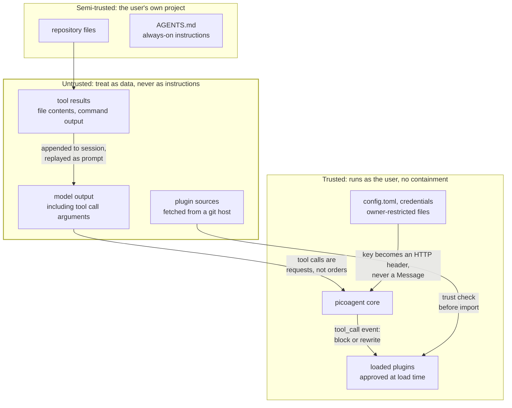
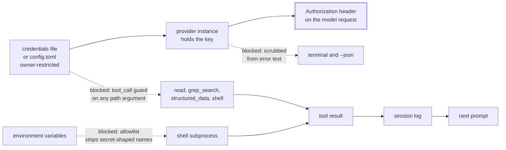

# Trust boundaries

Where the lines are, and what crosses them. This describes shipped behaviour, not intent.

## The boundaries



The fingerprint covers **every file in the plugin directory**, not just the entry module.
It used to cover only `plugin.toml` and the entry, which was a hole rather than a
simplification: the entry imports its siblings, so rewriting `helper.py` changed what
executed while the plugin still reported *trusted*. Every multi-module plugin was affected.
Skills are covered too - they are not executed, but they are injected into the model's prompt,
and text that steers the model is part of what was approved.

The load-time trust decision is the only boundary around plugin code. There is no sandbox: an
approved plugin can do anything the user can. That is why the approval flow shows what changed
rather than silently re-approving, and why declining leaves the plugin unloaded.

## Where a credential may travel

The rule the design holds to: **an API key must never reach the prompt or the session log.**
Both are the same problem, because tool results are persisted to the session and replayed to
the model on the next turn.



Solid arrows are the intended path: the key is read once at load, lives on the provider
instance, and becomes an `Authorization` header. It never enters a `Message`, so it cannot
reach the session or a later prompt by that route.

Dotted arrows are paths that were closed deliberately, each because it was reachable:

| Path | Control |
|---|---|
| A tool reads the credentials file or `config.toml` | `tool_call` guard blocks any tool whose path argument names a protected file, by inode identity, and blocks recursive tools pointed at a containing directory |
| `env` or `echo $VAR` in a shell command | The shell tool passes an allowlist of variables, not a denylist of secret-shaped names |
| A gateway echoes the key back in a 401 body | Provider error text is scrubbed before it reaches the terminal or the `--json` stream |
| A key typed into a slash command | Slash commands short-circuit before `session.append_message`, so they are never recorded |

## Confining file access

`read`, `write` and `edit` take a path from the model. By default any path resolves -
absolute ones and `..` traversal included - so the agent can reach anything the user can.

That is deliberate rather than an oversight. A coding agent legitimately edits sibling
repositories, files under `~/.config`, and things outside whatever directory it happened to
start in; confining it by default would break ordinary work. The boundary is the toolset, not
the path string.

Deployments that need the harder rule can turn it on:

```toml
confine_to_project = true   # read/write/edit refuse anything outside the project directory
```

With it on, a path resolving outside `cwd` comes back as a refused tool result rather than an
exception, so the model can see why and adjust. It is off by default because switching it on
is a real behavioural change, and on where an environment requires it.

This does not confine the `shell` tool, which runs commands as the user and can reach any file
the user can. Restricting that means not granting `shell` (`api.set_active_tools`) or gating it
with `permission-gate`.

## Known limits

Stated plainly, because a control that is oversold is worse than one that is absent.

**The shell file guard is a speed bump, not a boundary.** It matches `cat`-style commands
naming a protected path. `sed`, `xxd`, `python -c`, a relative path, or copying the file first
all defeat it. A shell running as you can read anything you can read; the real controls are the
environment allowlist and the tool-layer refusal.

**Every control is void if the plugin is not loaded.** credential-guard supplies the guards.
Untrusted or disabled, the built-in shell tool passes the entire environment through and no
`tool_call` guard exists.

**Owner-restriction is not encryption.** The credentials file is `0600` on POSIX and
ACL-restricted via `icacls` on Windows - the same trust model as `~/.netrc`. Anything running
as that user can read it. Where `icacls` cannot be confirmed, the CLI says so rather than
implying protection it did not achieve.

**Prompt injection is not solved.** Tool output is untrusted content that reaches the model as
context. The zeroth-law skill instructs treating it as data, but that is guidance to a model,
not an enforced control.
