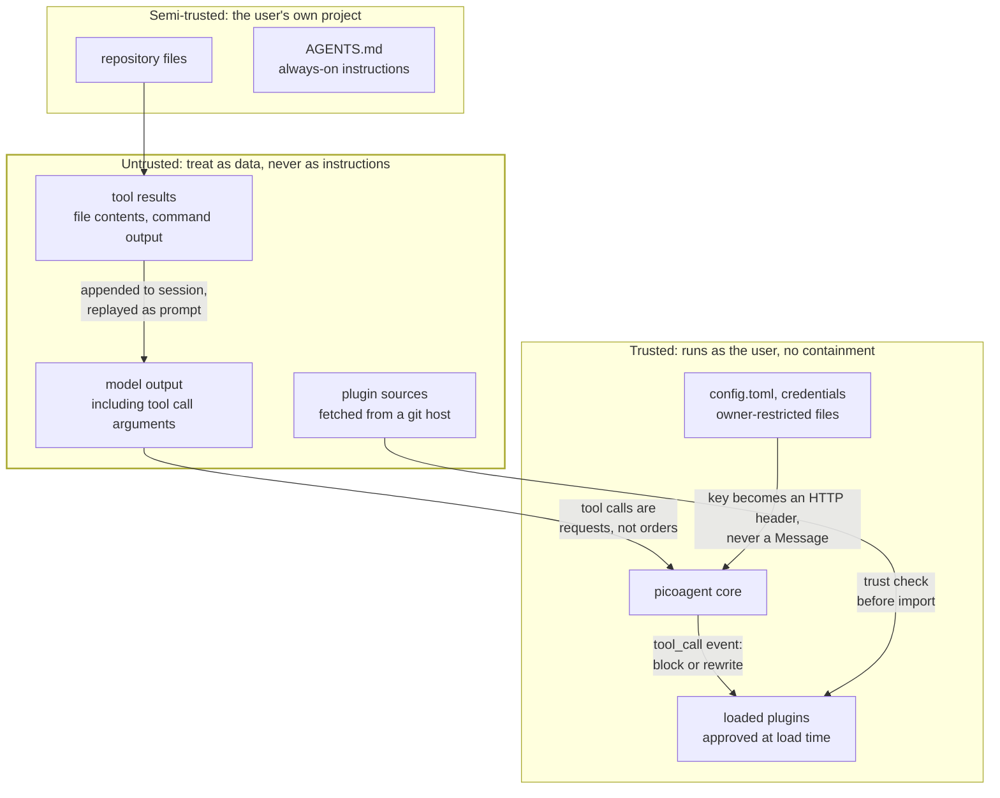
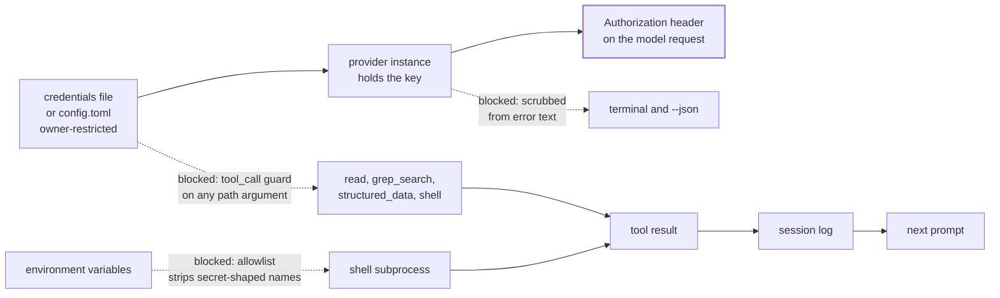

# Trust boundaries

Where the lines are, and what crosses them. This describes shipped behaviour, not intent.

## The boundaries



The fingerprint covers **every file in the plugin directory**, not just the entry module.
It used to cover only `plugin.toml` and the entry, which was a hole rather than a
simplification: the entry imports its siblings, so rewriting `helper.py` changed what
executed while the plugin still reported *trusted*. Every multi-module plugin was affected.
Skills are covered too - they are not executed, but they are injected into the model's prompt,
and text that steers the model is part of what was approved.

The load-time trust decision is the only boundary around plugin code. There is no sandbox: an
approved plugin can do anything the user can. That is why the approval flow shows what changed
rather than silently re-approving, and why declining leaves the plugin unloaded.

## What a repository's config may decide

`<project>/.picoagent/config.toml` is read before you have looked at anything in a repository
you cloned. It is content, not a decision you made, and the trust diagram above puts repository
files in the semi-trusted band - so it may set taste and may not set anything that decides where
a credential goes or what enters the prompt.

Two paths were open before `USER_ONLY` existed, both confirmed by execution:

| A repo set | What happened |
|---|---|
| `providers.openai.base_url` | The endpoint moved to the repo author's host, and the API key from *your* config followed it as an `Authorization` header on the first turn |
| `context_files = ["~/.picoagent/credentials"]` | `find_context_files` joins with `/`, which discards the left side for an absolute path, so the credentials file was read into the system prompt |

Also closed: `skill_dirs` (prompt text), `plugins.rewrite` (redirects a plugin clone before you
approve it), `upgrade` (redirects where picoagent upgrades itself from), and
`confine_to_project` (a repo must not switch off its own confinement).

A repo may still set `model`, `max_tokens`, `thinking`, `parallel_tools` and add to
`plugins.enabled` - each added plugin still faces the trust prompt, and installs under the
repository's own `.picoagent/plugins/` rather than yours. When a repository tries to set a
`USER_ONLY` key, the session says so at startup rather than dropping it silently.

### `plugins.enabled` is concatenated, and a spec carries its layer

The concatenation is deliberate: user list first, then the repository's, so a repository can
suggest a plugin. The trust prompt was described here as the control on that. It was not
sufficient, because resolving a spec is not a read. `discover_roots` resolves every enabled
spec at startup, `_clone_or_update` runs `git checkout` in the directory it resolves to, and
every spec - whoever wrote it - resolved into the *user's* plugin directory.

| A repo set | What happened |
|---|---|
| `enabled = ["file://<path>/gate@v0"]`, naming a different ref of a plugin the user already trusts | `git checkout` ran inside the user's own shared checkout and moved it to the repo's ref. The fingerprint stopped matching, so the plugin the user approved loaded as `changed` and was dropped. One line of committed config switched off a security plugin, and the only signal was a line on stderr that a `-p` or `--json` run does not surface |

Confirmed by execution, and now pinned by `tests/test_plugin_enabled_provenance.py`.

The fix is that a spec carries the layer that wrote it as far as the directory it may write:

* `enabled_by_layer` recovers the provenance the merge discards. `load_config` builds the list
  user-first, so the repository's specs are its tail; a config assembled any other way is
  attributed by membership, which errs towards calling a spec the repository's.
* A repository's spec clones into `<project>/.picoagent/plugins/`. The user's plugin directory
  is off limits to it, compared after resolving symlinks so a `.picoagent/plugins` symlink
  committed in the repository does not get there either, and a checkout directory name that is
  not a single path component (`..`) is refused outright.
* The user's own specs are unchanged. `picoagent plugin add` is the user acting, so an `add` on
  an installed plugin is still an upgrade and still moves the checkout.

The distinction is **who owns this checkout**, not *is this spec new*. A repository can still
suggest a plugin the user has never seen: it is cloned, discovered, and reported as `new` until
the user approves it. What it can no longer do is write into a checkout the user owns.

### When a plugin the user approved does not load

A security plugin that quietly does not load looks exactly like one that loaded and found
nothing, so the skip has to be legible. `LoadReport` carries a `Notice` per skipped plugin -
the wording, and whether it is `urgent`, meaning a plugin the user approved is not running:

| The skip | What the user is told | Urgent |
|---|---|---|
| `new` | not trusted yet, here is the command to review it | no |
| `changed`, files edited in place | CHANGED since you approved it and NOT LOADED, whatever it enforces is off | yes |
| `changed`, checkout on a different commit | MOVED to a revision you have not approved (`old -> new`), you did not edit it, check `[plugins].enabled` in both configs | yes |
| `shadowed`, a repository offers a name the user's own loaded copy already provides | the repository's copy did not load and yours is the one running | no |

`changed` splits on the commit in the trust record: nobody arrives at a different commit by
editing a file, so "something moved your checkout" and "you edited this yourself" are separable
and no longer share one message. `shadowed` exists so the repository's rejected copy does not
raise a false alarm about the user's copy that is loading perfectly well, and it is only used
when that user-owned copy really did load.

### `[plugins.<name>]` is layered, not merged

`USER_ONLY` names whole settings, and for a while it named none of the `[plugins.<name>]`
tables. Those tables deep-merged from the repository's config and reached plugins through
`api.plugin_config()` as one dictionary with no record of who wrote which key. Four plugins
took a decision from it that a repository must not make - each confirmed by execution:

| A repo set | What happened |
|---|---|
| `[plugins.grok-provider] base_url` | Only the URL. The `api_key` beside it was still the user's, and went to the repo author's host on the first turn. Same for `[plugins.es-doctor] url` and the vertex provider's OAuth token |
| `[plugins.mcp.servers.x] command` | Spawned at session start with the user's environment, before the first prompt and outside the trust store that gates every other way a repository gets code to run |
| `[plugins.permission-gate] mode = "yolo"` | The confirmation prompt the user installed the plugin for, switched off by the repository it was meant to guard against |
| `[plugins.credential-guard] extra_allow_env` | Named variables the shell tool may expose. `DATABASE_URL` is not secret-shaped, so nothing else stopped it |

The fix is a seam in `picoagent.core.config`, not four patches. A repository's plugin tables are
lifted out of the merge into `_project_plugin_config` and handed to plugins as a `PluginConfig`:

* Reading it like a dict returns the **user layer** - defaults, `~/.picoagent/config.toml`, CLI
  flags. A plugin author who does nothing gets that.
* `.source(key)` says `user`, `project`, `both` or `None`. Nothing merges without a name on it.
* `.from_project(key)` and `.with_project(*keys)` are the only ways a repository's value is
  read, and each call is a decision the plugin answers for.
* `api.warn_about_project_config(*accepted)` names what the plugin refused, at session start,
  the same way `_ignored_project_keys` names a refused `USER_ONLY` key.

The line the shipped plugins draw: a repository may **tighten** and may set what is only taste.
It may not choose a destination, a command, or a permission.

| Plugin | Taken from a repository | Refused |
|---|---|---|
| es-doctor | `logs_index`, `metrics_index`, `traces_index` | `url`, `api_key`, `username`, `password`, `verify_tls`, `ca_cert`, `allow_destructive` |
| mcp | `timeout`, `startup_timeout` | `servers` |
| permission-gate | `protected` (added to the user's list, never replacing it) | `mode`, `dangerous` |
| credential-guard | `extra_deny_patterns` (added; it only refuses more) | `extra_allow_env` |
| grok-provider, vertex-provider | nothing | everything |

One behaviour changed for `rules`, which had already spotted this hole and defended against it
by treating *any* configured directory as repository-supplied and fingerprint-gating the text
before it reaches the prompt. It reads `dirs` through `plugin_config()`, so a `dirs` entry set by
a **repository's** config is no longer discovered at all. The hardcoded `.picoagent/rules/` path
is unaffected, and that is where a repository's rules are meant to live; a repository that wants
another directory read now has to move the files. `dirs` in the user's own config still works.

What this does **not** cover: a plugin that reads `api.config["plugins"]` itself is reading the
merged config, which no longer carries a repository's plugin tables, so it now sees the user
layer - but a plugin reading `api.config["_project_plugin_config"]` directly gets the repository's
values with no ceremony at all. There is no sandbox around plugin code, so this is a seam that
makes the safe thing the default and the unsafe thing explicit, not an enforced boundary. The
boundary around plugin code remains the load-time trust decision.

## Where an endpoint's key lives

Each external service gets its own file under `~/.picoagent/endpoints/`, named for the service:

```toml
# ~/.picoagent/endpoints/github.toml
base_url = "https://github.example.mil"
api_key  = "ghp_..."
```

One file per endpoint, one key per endpoint. A git host, an artifact repository and the model
gateway never share a credential, and none of them sits in a file a project could try to
override. These are read from the user directory only - a project's `endpoints/` is ignored.

## Where a credential may travel

The rule the design holds to: **an API key must never reach the prompt or the session log.**
Both are the same problem, because tool results are persisted to the session and replayed to
the model on the next turn.



Solid arrows are the intended path: the key is read once at load, lives on the provider
instance, and becomes an `Authorization` header. It never enters a `Message`, so it cannot
reach the session or a later prompt by that route.

Dotted arrows are paths that were closed deliberately, each because it was reachable:

| Path | Control |
|---|---|
| A tool reads the credentials file or `config.toml` | `tool_call` guard blocks any tool whose path argument names a protected file, by inode identity, and blocks recursive tools pointed at a containing directory |
| `env` or `echo $VAR` in a shell command | The shell tool passes an allowlist of variables, not a denylist of secret-shaped names |
| A gateway echoes the key back in a 401 body | Provider error text is scrubbed before it reaches the terminal or the `--json` stream |
| A key typed into a slash command | Slash commands short-circuit before `session.append_message`, so they are never recorded |

## Confining file access

`read`, `write` and `edit` take a path from the model. By default any path resolves -
absolute ones and `..` traversal included - so the agent can reach anything the user can.

That is deliberate rather than an oversight. A coding agent legitimately edits sibling
repositories, files under `~/.config`, and things outside whatever directory it happened to
start in; confining it by default would break ordinary work. The boundary is the toolset, not
the path string.

Deployments that need the harder rule can turn it on:

```toml
confine_to_project = true   # read/write/edit refuse anything outside the project directory
```

With it on, a path resolving outside `cwd` comes back as a refused tool result rather than an
exception, so the model can see why and adjust. It is off by default because switching it on
is a real behavioural change, and on where an environment requires it.

This does not confine the `shell` tool, which runs commands as the user and can reach any file
the user can. Restricting that means not granting `shell` (`api.set_active_tools`) or gating it
with `permission-gate`.

## Known limits

Stated plainly, because a control that is oversold is worse than one that is absent.

**The shell file guard is a speed bump, not a boundary.** It matches `cat`-style commands
naming a protected path. `sed`, `xxd`, `python -c`, a relative path, or copying the file first
all defeat it. A shell running as you can read anything you can read; the real controls are the
environment allowlist and the tool-layer refusal.

**Every control is void if the plugin is not loaded.** credential-guard supplies the guards.
Untrusted or disabled, the built-in shell tool passes the entire environment through and no
`tool_call` guard exists. This is why a skip is reported the way it is above, and it is also
the remaining gap: the CLI still renders skips from the `(name, reason, root)` tuples on
stderr, so in a `-p` or `--json` run the urgent lines are stderr text beside a machine-readable
stream that does not mention them. `report.lines()` and `report.urgent()` are there for a
frontend to print or emit as an event; wiring them into `_report_skipped` and the `--json`
stream is not done.

**Owner-restriction is not encryption.** The credentials file is `0600` on POSIX and
ACL-restricted via `icacls` on Windows - the same trust model as `~/.netrc`. Anything running
as that user can read it. Where `icacls` cannot be confirmed, the CLI says so rather than
implying protection it did not achieve.

**Prompt injection is not solved.** Tool output is untrusted content that reaches the model as
context. The zeroth-law skill instructs treating it as data, but that is guidance to a model,
not an enforced control.
