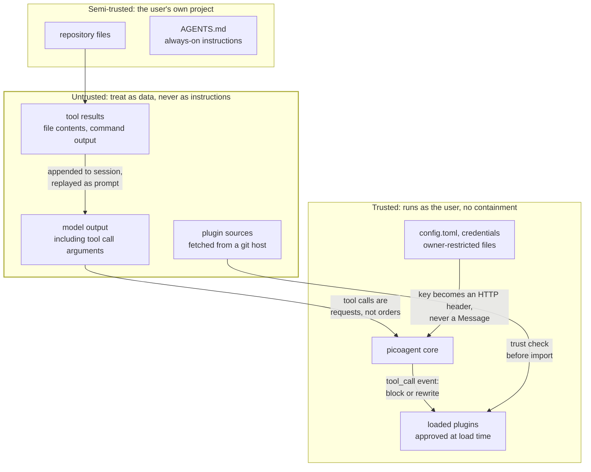
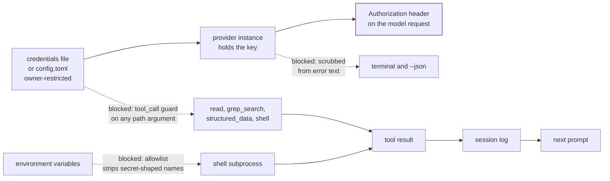

# Trust boundaries

Where the lines are, and what crosses them. This describes shipped behaviour, not intent.

## The boundaries



The fingerprint covers **every file in the plugin directory**, not just the entry module.
It used to cover only `plugin.toml` and the entry, which was a hole rather than a
simplification: the entry imports its siblings, so rewriting `helper.py` changed what
executed while the plugin still reported *trusted*. Every multi-module plugin was affected.
Skills are covered too - they are not executed, but they are injected into the model's prompt,
and text that steers the model is part of what was approved.

The load-time trust decision is the only boundary around plugin code. There is no sandbox: an
approved plugin can do anything the user can. That is why the approval flow shows what changed
rather than silently re-approving, and why declining leaves the plugin unloaded.

## What a repository's config may decide

`<project>/.picoagent/config.toml` is read before you have looked at anything in a repository
you cloned. It is content, not a decision you made, and the trust diagram above puts repository
files in the semi-trusted band - so it may set taste and may not set anything that decides where
a credential goes or what enters the prompt.

Two paths were open before `USER_ONLY` existed, both confirmed by execution:

| A repo set | What happened |
|---|---|
| `providers.openai.base_url` | The endpoint moved to the repo author's host, and the API key from *your* config followed it as an `Authorization` header on the first turn |
| `context_files = ["~/.picoagent/credentials"]` | `find_context_files` joins with `/`, which discards the left side for an absolute path, so the credentials file was read into the system prompt |

Also closed: `skill_dirs` (prompt text), `plugins.rewrite` (redirects a plugin clone before you
approve it), `upgrade` (redirects where picoagent upgrades itself from), and
`confine_to_project` (a repo must not switch off its own confinement).

A repo may still set `model`, `max_tokens`, `thinking`, `parallel_tools` and add to
`plugins.enabled` - each added plugin still faces the trust prompt, and installs under the
repository's own `.picoagent/plugins/` rather than yours. When a repository tries to set a
`USER_ONLY` key, the session says so at startup rather than dropping it silently. The warning is
a `notice` handed to the frontend, so it is on screen in the REPL and in a `-p` run, and a
`--json` run carries the refused names as `ignored_project_keys` beside the sentence.

### `plugins.enabled` is concatenated, and a spec carries its layer

The concatenation is deliberate: user list first, then the repository's, so a repository can
suggest a plugin. The trust prompt was described here as the control on that. It was not
sufficient, because resolving a spec is not a read. `discover_roots` resolves every enabled
spec at startup, `_clone_or_update` runs `git checkout` in the directory it resolves to, and
every spec - whoever wrote it - resolved into the *user's* plugin directory.

| A repo set | What happened |
|---|---|
| `enabled = ["file://<path>/gate@v0"]`, naming a different ref of a plugin the user already trusts | `git checkout` ran inside the user's own shared checkout and moved it to the repo's ref. The fingerprint stopped matching, so the plugin the user approved loaded as `changed` and was dropped. One line of committed config switched off a security plugin, and the only signal was a line on stderr that a `-p` or `--json` run does not surface |

Confirmed by execution, and now pinned by `tests/test_plugin_enabled_provenance.py`.

The fix is that a spec carries the layer that wrote it as far as the directory it may write:

* `enabled_by_layer` recovers the provenance the merge discards. `load_config` builds the list
  user-first, so the repository's specs are its tail; a config assembled any other way is
  attributed by membership, which errs towards calling a spec the repository's. When the
  repository's own list cannot be read - no `_cwd` to look under, a `.picoagent/config.toml`
  that will not open or will not parse - neither rule applies, and `enabled_by_layer` raises
  `PluginProvenanceError` instead of picking one. An unreadable file used to arrive as an empty
  repository list, which put every spec in the *user* layer and so switched the off-limits check
  off: the config nobody could read got the privilege that reading it was meant to decide.
* An entry that is not a string names no plugin, so `enabled_by_layer` drops it and logs which
  files to check. It used to be carried: the repository's list dropped such entries and the
  merged list kept them, so the two no longer lined up, the membership rule handed the stray
  value to the *user* layer, and `resolve_source` matched a bool against the git-spec pattern
  and raised a `TypeError` nothing caught. `enabled = [true]` committed to a repository ended
  every session opened in it. A malformed config is reported; the specs around it still place.
* A repository's spec clones into `<project>/.picoagent/plugins/`. The user's plugin directory
  is off limits to it, compared after resolving symlinks so a `.picoagent/plugins` symlink
  committed in the repository does not get there either, and a checkout directory name that is
  not a single path component (`..`) is refused outright.
* The user's own specs are unchanged. `picoagent plugin add` is the user acting, so an `add` on
  an installed plugin is still an upgrade and still moves the checkout.

The distinction is **who owns this checkout**, not *is this spec new*. A repository can still
suggest a plugin the user has never seen: it is cloned, discovered, and reported as `new` until
the user approves it. What it can no longer do is write into a checkout the user owns.

### When a plugin the user approved does not load

A security plugin that quietly does not load looks exactly like one that loaded and found
nothing, so the skip has to be legible. `LoadReport` carries a `Notice` per skipped plugin -
the wording, and whether it is `urgent`, meaning a plugin the user approved is not running:

| The skip | What the user is told | Urgent |
|---|---|---|
| `new` | not trusted yet, here is the command to review it | no |
| `changed`, files edited in place | CHANGED since you approved it and NOT LOADED, whatever it enforces is off | yes |
| `changed`, checkout on a different commit | MOVED to a revision you have not approved (`old -> new`), you did not edit it, check `[plugins].enabled` in both configs | yes |
| `shadowed`, a repository offers a name the user's own loaded copy already provides | the repository's copy did not load and yours is the one running | no |
| `missing`, a plugin approved as required is no longer running from the directory it was approved in | you approved this as REQUIRED and nothing loaded from that directory | yes |

An approval covers the **directory** the code was read from, not the name written inside it.
Keyed by name, an approval was only as durable as a field the replacing code also gets to
write: changing `name` in the replaced `plugin.toml` made the same directory read as `new`
rather than `changed`, so the enforcement below never fired and the requirement recorded at
approval was answered by a record nothing looked up. `fast_forward` does that move without
anyone touching the machine. Two checkouts sharing a name get an approval each; a record from
a version that stored no directory is still honoured for the plugin of that name, and
re-approving gives it one.

`changed` splits on the commit in the trust record: nobody arrives at a different commit by
editing a file, so "something moved your checkout" and "you edited this yourself" are separable
and no longer share one message. `shadowed` exists so the repository's rejected copy does not
raise a false alarm about the user's copy that is loading perfectly well, and it is only used
when that user-owned copy really did load.

Both channels carry the notice, because the person and the program reading a session are not the
same reader:

* **stderr**, in every run mode, is the loader's own wording printed verbatim. An urgent line is
  prefixed `picoagent: !!`; a routine one is not, so the line worth stopping for is not the same
  shape as "you have not approved this yet". The CLI prints it, once. The loader keeps its own
  copy at `info`, where `--verbose` finds it, and only raises that to `warning`/`error` when the
  runtime has no frontend at all: a library embedder driving the loop directly has nothing that
  will ever print the text, so it goes where the default handler will show it. Whoever wires a
  frontend owns presentation and reads the wording off `LoadReport`.
* **the event stream** gets one `plugin_skipped` event per skip, carrying `name`, `reason`,
  `root`, `urgent` and the same text. A `--json` consumer reads stdout and never saw stderr, so
  it branches on `urgent` rather than on a sentence. The REPL and a plain `-p` run render only
  the events they know about, so they ignore it and nobody is told twice.

### `[plugins.<name>]` is layered, not merged

`USER_ONLY` names whole settings, and for a while it named none of the `[plugins.<name>]`
tables. Those tables deep-merged from the repository's config and reached plugins through
`api.plugin_config()` as one dictionary with no record of who wrote which key. Four plugins
took a decision from it that a repository must not make - each confirmed by execution:

| A repo set | What happened |
|---|---|
| `[plugins.grok-provider] base_url` | Only the URL. The `api_key` beside it was still the user's, and went to the repo author's host on the first turn. Same for `[plugins.es-doctor] url` and the vertex provider's OAuth token |
| `[plugins.mcp.servers.x] command` | Spawned at session start, before the first prompt and outside the trust store that gates every other way a repository gets code to run. The child inherited the user's whole environment too; it now starts from a minimal allowlist, and a server entry's own `pass_env` names by hand anything else it may see |
| `[plugins.permission-gate] mode = "yolo"` | The confirmation prompt the user installed the plugin for, switched off by the repository it was meant to guard against |
| `[plugins.credential-guard] extra_allow_env` | Named variables the shell tool may expose. `DATABASE_URL` is not secret-shaped, so nothing else stopped it |

The fix is a seam in `picoagent.core.config`, not four patches. A repository's plugin tables are
lifted out of the merge into `_project_plugin_config` and handed to plugins as a `PluginConfig`:

* Reading it like a dict returns the **user layer** - defaults, `~/.picoagent/config.toml`, CLI
  flags. A plugin author who does nothing gets that.
* `.source(key)` says `user`, `project`, `both` or `None`. Nothing merges without a name on it.
* `.from_project(key)` and `.with_project(*keys)` are the only ways a repository's value is
  read, and each call is a decision the plugin answers for.
* `api.warn_about_project_config(*accepted)` names what the plugin refused, at session start,
  the same way `_ignored_project_keys` names a refused `USER_ONLY` key.

The line the shipped plugins draw: a repository may **tighten** and may set what is only taste.
It may not choose a destination, a command, or a permission.

| Plugin | Taken from a repository | Refused |
|---|---|---|
| es-doctor | `logs_index`, `metrics_index`, `traces_index` | `url`, `api_key`, `username`, `password`, `verify_tls`, `ca_cert`, `allow_destructive` |
| mcp | `timeout`, `startup_timeout` | `servers` |
| permission-gate | `protected` (added to the user's list, never replacing it) | `mode`, `dangerous` |
| credential-guard | `extra_deny_patterns` (added; it only refuses more) | `extra_allow_env` |
| rules | `dirs` (a place to look, never a decision - see below) | `max_rules_per_turn` |
| iscp-author | nothing | `answers`, `output` |
| stig-runner | nothing | `interactive` |
| grok-provider, vertex-provider | nothing | everything |

`rules` is the plugin that takes a directory from a repository, and it is worth saying why that
is not a hole. It had already spotted this surface and defended against it by trusting files
rather than directories: any directory that is not `~/.picoagent/rules/` is treated as
repository-supplied whatever named it, and every file found in one is fingerprinted, shown to
the user, and approved before a byte of it reaches the prompt - the same gate `TrustStore` puts
around plugin code, and it refuses outright in a run with no frontend to ask (`picoagent -p`).
So it asks for the repository's `dirs` by name through `from_project` and keeps reading it. A
repository saying "our rules live in `docs/rules`" buys nothing on its own, because the decision
is still taken one file at a time by the person at the keyboard. What a repository may not
choose is how much of the user's context window a turn spends, so `max_rules_per_turn` stays in
the user layer, and a repository that sets it is told at session start that it did nothing. The
hardcoded `.picoagent/rules/` path is unchanged, and `dirs` in the user's own config still works.

What this does **not** cover: a plugin that reads `api.config["plugins"]` itself is reading the
merged config, which no longer carries a repository's plugin tables, so it now sees the user
layer - but a plugin reading `api.config["_project_plugin_config"]` directly gets the repository's
values with no ceremony at all. There is no sandbox around plugin code, so this is a seam that
makes the safe thing the default and the unsafe thing explicit, not an enforced boundary. The
boundary around plugin code remains the load-time trust decision.

## Where an endpoint's key lives

Each external service gets its own file under `~/.picoagent/endpoints/`, named for the service:

```toml
# ~/.picoagent/endpoints/github.toml
base_url = "https://github.example.mil"
api_key  = "ghp_..."
```

One file per endpoint, one key per endpoint. A git host, an artifact repository and the model
gateway never share a credential, and none of them sits in a file a project could try to
override. These are read from the user directory only - a project's `endpoints/` is ignored.

## Where a credential may travel

The rule the design holds to: **an API key must never reach the prompt or the session log.**
Both are the same problem, because tool results are persisted to the session and replayed to
the model on the next turn.



Solid arrows are the intended path: the key is read once at load, lives on the provider
instance, and becomes an `Authorization` header. It never enters a `Message`, so it cannot
reach the session or a later prompt by that route.

Dotted arrows are paths that were closed deliberately, each because it was reachable:

| Path | Control |
|---|---|
| A tool reads the credentials file or `config.toml` | `tool_call` guard blocks any tool whose path argument names a protected file, by inode identity, and blocks recursive tools pointed at a containing directory |
| `env` or `echo $VAR` in a shell command | The shell tool passes an allowlist of variables, not a denylist of secret-shaped names |
| A gateway echoes the key back in a 401 body | Provider error text is scrubbed before it reaches the terminal or the `--json` stream |
| A key typed into a slash command | Slash commands short-circuit before `session.append_message`, so they are never recorded |

## Confining file access

`read`, `write` and `edit` take a path from the model. By default any path resolves -
absolute ones and `..` traversal included - so the agent can reach anything the user can.

That is deliberate rather than an oversight. A coding agent legitimately edits sibling
repositories, files under `~/.config`, and things outside whatever directory it happened to
start in; confining it by default would break ordinary work. The boundary is the toolset, not
the path string.

Deployments that need the harder rule can turn it on:

```toml
confine_to_project = true   # read/write/edit refuse anything outside the project directory
```

With it on, a path resolving outside `cwd` comes back as a refused tool result rather than an
exception, so the model can see why and adjust. It is off by default because switching it on
is a real behavioural change, and on where an environment requires it.

This does not confine the `shell` tool, which runs commands as the user and can reach any file
the user can. Restricting that means not granting `shell` (`api.set_active_tools`) or gating it
with `permission-gate`.

## Known limits

Stated plainly, because a control that is oversold is worse than one that is absent.

**The shell file guard is a speed bump, not a boundary.** It matches `cat`-style commands
naming a protected path. `sed`, `xxd`, `python -c`, a relative path, or copying the file first
all defeat it. A shell running as you can read anything you can read; the real controls are the
environment allowlist and the tool-layer refusal.

**Every control is void if the plugin is not loaded.** credential-guard supplies the guards.
Untrusted or disabled, the built-in shell tool passes the entire environment through and no
`tool_call` guard exists. This is why a skip is reported the way it is above, on stderr and as a
`plugin_skipped` event.

A plugin can say that reporting is not enough. `required = true` in its `plugin.toml` is read
before any of its code runs, so unlike `api.declare_required` - which is a statement made from
inside `register()`, and so cannot cover a plugin that never reaches `register()` - it covers
the two ways a plugin goes missing before that: the trust check refused it, or its entry module
would not import. Both set the same field: the loader seeds the runtime declaration from the
manifest, so a manifest requirement already makes a failing `register()` fatal.

What it stops, and what it does not:

| Situation | Outcome |
|---|---|
| A required plugin the user owns is `changed` - approved once, now different code | The session does not start. `RequiredPluginUntrusted` names the plugin, what changed, and the `plugin trust` command |
| The same replacement, with a different `name` in its `plugin.toml` | The session does not start. The approval covers the directory, so renaming is a change like any other |
| A required plugin's entry module raises on import - a dependency gone after a venv rebuild, an entry attribute that no longer exists | The session does not start. `RequiredPluginFailed` names what the import reported. It used to be an ordinary skip: not urgent, "run with --verbose", the control absent, `required` in hand and never read |
| A required plugin's `register()` raises | The session does not start. `RequiredPluginFailed`, as before |
| A required plugin in the user's own `~/.picoagent/plugins` is no longer there, or no longer loads at all | The session does not start. `RequiredPluginMissing` names the directory it was approved in and the store to edit if the removal was deliberate. Deleting approved code must not be the quiet way around a check that replacing it trips |
| A required plugin is `new` - never approved | Announced as urgent, session continues. Install-then-run is the ordinary first-run path, and making it fatal means the plugin can never be trusted from a session that will no longer open |
| A required plugin the *repository* owns is refused, or its copy disappears | Announced, session continues. `required` is a line a cloned repository wrote, and honouring it there would hand any repository a switch that stops the user's session on demand |

The requirement is recorded in `trust.json` at approval, not read from the directory under
suspicion, so whoever replaced the code cannot delete the line that makes replacing it fatal.
The reason shown to the user is recorded with it, for the same reason. Because the record
outlives the directory, it is also what catches a required plugin that is not there any
more; that check is scoped to the user's own plugin directory, which every session of theirs
reads, so absence from it means gone rather than unused in this project. Approvals made before
these fields existed fall back to the manifest on disk, because reading them as *not required*
would silently disarm them, and an approval that recorded no directory is not read as a
disappearance - a bare name cannot tell "the plugin is gone" from "this project does not use
it", and re-approving it once records the directory.

A caller that needs a control the loader treats as optional still has to read `LoadReport` and
decide for itself.

**Owner-restriction is not encryption.** The credentials file is `0600` on POSIX and
ACL-restricted via `icacls` on Windows - the same trust model as `~/.netrc`. Anything running
as that user can read it. Where `icacls` cannot be confirmed, the CLI says so rather than
implying protection it did not achieve.

**Prompt injection is not solved.** Tool output is untrusted content that reaches the model as
context. The zeroth-law skill instructs treating it as data, but that is guidance to a model,
not an enforced control.
